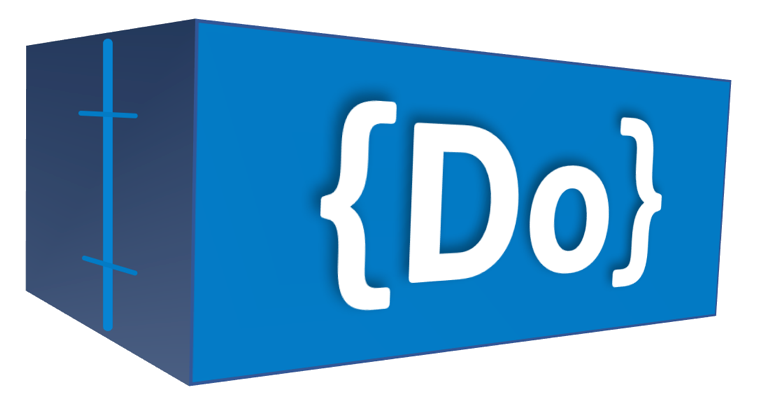

 

# Do Framework 
The [Do Framework](https://github.com/iankoulski/do-framework) is a [DevOps](https://en.wikipedia.org/wiki/DevOps) framework focused on simplicity, intuitiveness, and productivity. It helps you get more done.

Your project is NOT a [Do Framework](https://github.com/iankoulski/do-framework) project if:
* you have to do more than one step to get something done
* you don't know how to get something done, without reading the documentation first
* you are not able to get your work done quickly

The [Do Framework](https://github.com/iankoulski/do-framework) is defined by its phylosophy and principles.

# Phylosophy
1. Software development and operations should get simpler over time, regardless of the rising complexity of systems and technologies. 
2. Humans should be able to develop and operate systems intuitively, without need for extensive learning 
3. Humans should be able to get more done with less effort and faster over time

# Principles
1. **Simplicity** - favor simplicity, encapsulate complex functionality into single, simple, intuitive, and actionable artifacts; standardize artifacts across projects
2. **Flexibility** - "batteries included, but swappable"; each project should come pre-configured with reasonable defaults which work out of the box, but should be completely customizable through centralized configuration
3. **Universality** - generalize, build projects that solve problems universally, so when the same problem needs to be solved in a different setting (different cloud, operating system, processor, etc.), you don't have to build a new project.

# Implementation
Any project that adheres to the phylosophy of the framework and abides by its principles is considered to be a [Do Framework](https://github.com/iankoulski/do-framework) project. The choice of a technology stack and tooling belongs entirely to the implementation. The [Depend on Docker](https://github.com/iankoulski/depend-on-docker) project is the first known [Do Framework](https://github.com/iankoulski/do-framework) implementation. 

## "Depend on Docker" Project
The [Depend on Docker](https://github.com/iankoulski/depend-on-docker) project is a template for building [Do Framework](https://github.com/iankoulski/do-framework) projects using [Docker](https://www.docker.com). 

It is:
* **Simple**
    * Creates a new project with a single command
    * Depends only on [Docker](https://docker.com) to go from source to production
    * Standarizes user interaction through a set of intuitive action scripts: `./config.sh`, `./build.sh`, `./push.sh`, `./pull.sh`, `./run.sh`, `./exec.sh`, `./status.sh`, `./logs.sh`, `./test.sh`, `./stop.sh`.
* **Flexible**
    * Works with the included default settings, but is also fully customizable 
* **Universal**
    * Runs on Linux or Windows, locally or in the cloud

The [Depend on Docker](https://github.com/iankoulski/depend-on-docker) project challenges us to never install anything other than [Docker](https://docker.com) directly on our machines. It helps us build and run containers instead.

# Examples
Below is a list of open source [Do Framework](https://github.com/iankoulski/do-framework) projects that have been built using the [Depend on Docker](https://github.com/iankoulski/depend-on-docker) template.

* [tree](https://github.com/iankoulski/tree)
* [enigma](https://github.com/iankoulski/enigma)
* [gcp-gpu-monitor](https://github.com/iankoulski/gcp-gpu-monitor)
* [romario](https://github.com/fabiononato/romario)
* [face-recognition](https://github.com/iankoulski/depend-on-docker-ai)
* [gitlab](https://github.com/iankoulski/gitlab)
* [aws-do-docker](https://github.com/aws-samples/aws-do-docker)
* [aws-do-cli](https://github.com/aws-samples/aws-do-cli)
* [aws-do-eks](https://github.com/aws-samples/aws-do-eks)
* [aws-do-simnet](https://github.com/aws-samples/aws-do-simnet)
* [aws-do-pm](https://github.com/aws-samples/aws-do-pm)
* [aws-do-kubeflow](https://github.com/aws-samples/aws-do-kubeflow)
